# OBSystem — Öğrenci Bilgi Sistemi

**Versiyon:** 1.0.0 | **Tarih:** Şubat 2026

Üniversite öğrenci bilgi sistemi. Kayıt, ders yönetimi, not girişi ve akademik takip işlemlerini dijitalleştirir.

---

## İçindekiler

1. [Genel Bakış](#1-genel-bakış)
2. [Teknoloji Yığını](#2-teknoloji-yığını)
3. [Sistem Mimarisi](#3-sistem-mimarisi)
4. [Veritabanı Tasarımı (ER Diyagramı)](#4-veritabanı-tasarımı)
5. [Önyüz Rota Yapısı](#5-önyüz-rota-yapısı)
6. [Kimlik Doğrulama Akışı](#6-kimlik-doğrulama-akışı)
7. [Önyüz ↔ Arkayüz İletişimi](#7-önyüz--arkayüz-iletişimi)
8. [RBAC — Rol Tabanlı Erişim Kontrolü](#8-rbac)
9. [Not Hesaplama Mantığı](#9-not-hesaplama-mantığı)
10. [Docker Altyapısı](#10-docker-altyapısı)
11. [Proje Durumu](#11-proje-durumu)

---

## 1. Genel Bakış

OBSystem, üniversite süreçlerini yönetmek için geliştirilmiş bir web uygulamasıdır.

| Kullanıcı | Yetkiler |
|---|---|
| **Admin** | Kullanıcı, fakülte, bölüm, ders ve dönem yönetimi |
| **Öğretim Üyesi** | Kendi derslerinde not girişi, devamsızlık takibi |
| **Öğrenci** | Ders kaydı talebi, not görüntüleme, transkript |

---

## 2. Teknoloji Yığını

| Katman | Teknoloji | Versiyon |
|---|---|---|
| **Arkayüz** | Java + Spring Boot | 21 / 4.0.2 |
| **Veritabanı** | PostgreSQL + Flyway | 17.x |
| **Önyüz** | Next.js + TypeScript + Tailwind CSS | 14 |
| **Auth** | JWT (Stateless, RBAC) | — |
| **Konteyner** | Docker + Docker Compose | — |
| **ORM** | Hibernate / Spring Data JPA | — |
| **Migration** | Flyway | 11.x |

---

## 3. Sistem Mimarisi

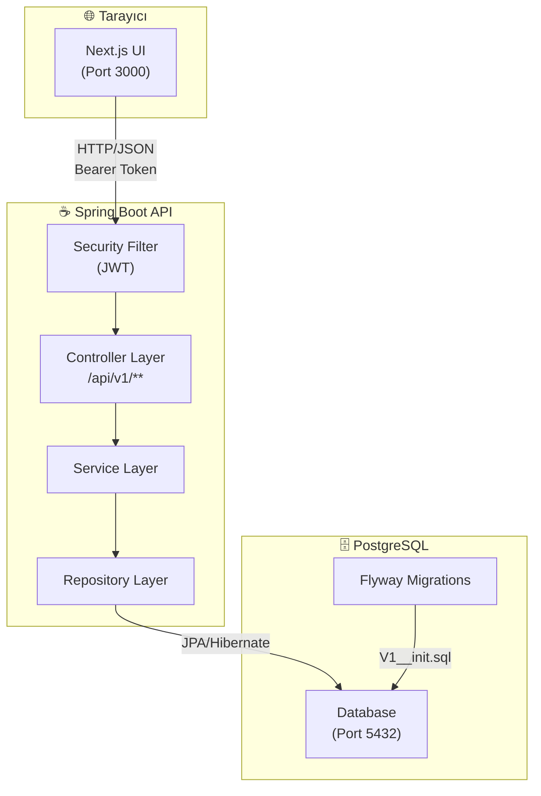

### Katmanlı Mimari (Backend)

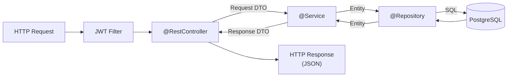

---

## 4. Veritabanı Tasarımı

### ER Diyagramı

```mermaid
erDiagram
    faculties {
        bigserial id PK
        varchar name UK
        timestamp created_at
        timestamp updated_at
    }

    departments {
        bigserial id PK
        bigint faculty_id FK
        varchar name
        timestamp created_at
        timestamp updated_at
    }

    users {
        bigserial id PK
        varchar username UK
        varchar password
        varchar email UK
        varchar role
        boolean is_active
        timestamp created_at
        timestamp updated_at
    }

    teachers {
        bigint id PK_FK
        varchar fullname
        varchar title
        bigint department_id FK
        timestamp created_at
        timestamp updated_at
    }

    students {
        bigint id PK_FK
        varchar student_no UK
        bigint advisor_id FK
        varchar fullname
        varchar telephone
        bigint department_id FK
        integer enrollment_year
        smallint class_year
        timestamp created_at
        timestamp updated_at
    }

    semesters {
        bigserial id PK
        varchar semester_name
        date start_date
        date end_date
        date registration_start
        date registration_end
        boolean is_active
        timestamp created_at
        timestamp updated_at
    }

    lessons {
        bigserial id PK
        varchar course_code UK
        varchar lesson_name
        smallint credit
        smallint ects
        varchar lesson_type
        bigint department_id FK
        timestamp created_at
        timestamp updated_at
    }

    teacher_lessons {
        bigserial id PK
        bigint teacher_id FK
        bigint lesson_id FK
        bigint semester_id FK
        varchar role
        boolean is_active
        integer quota
        timestamp created_at
        timestamp updated_at
    }

    enrollment_requests {
        bigserial id PK
        bigint student_id FK
        bigint teacher_lesson_id FK
        bigint semester_id FK
        varchar status
        bigint reviewed_by FK
        text review_note
        timestamp requested_at
        timestamp reviewed_at
    }

    grade_scale {
        bigserial id PK
        varchar letter UK
        decimal min_score
        decimal max_score
        decimal gpa_point
        boolean is_passing
    }

    notelist {
        bigserial id PK
        bigint student_id FK
        bigint teacher_lesson_id FK
        decimal midterm_note
        decimal final_note
        decimal makeup_exam
        decimal average
        varchar letter_grade FK
        varchar status
        integer absenteeism_count
        timestamp created_at
        timestamp updated_at
    }

    faculties ||--o{ departments : "içerir"
    departments ||--o{ teachers : "barındırır"
    departments ||--o{ students : "kayıtlıdır"
    departments ||--o{ lessons : "açar"
    users ||--o| teachers : "extends"
    users ||--o| students : "extends"
    teachers ||--o{ teacher_lessons : "verir"
    lessons ||--o{ teacher_lessons : "içinde"
    semesters ||--o{ teacher_lessons : "dönemde"
    teacher_lessons ||--o{ enrollment_requests : "için talep"
    teacher_lessons ||--o{ notelist : "not listesi"
    students ||--o{ enrollment_requests : "yapar"
    students ||--o{ notelist : "alır"
    teachers ||--o{ students : "danışman"
    grade_scale ||--o{ notelist : "harf notu"
    semesters ||--o{ enrollment_requests : "dönemde"
```

### Tablo İlişkileri Özeti

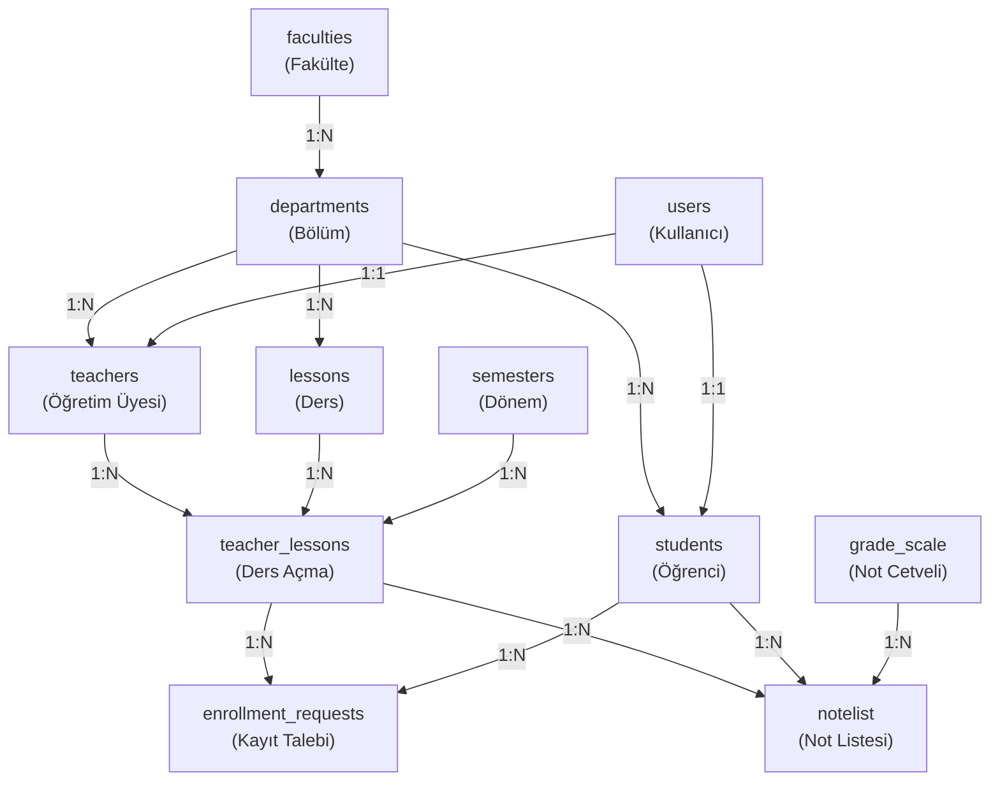

---

## 5. Önyüz Rota Yapısı

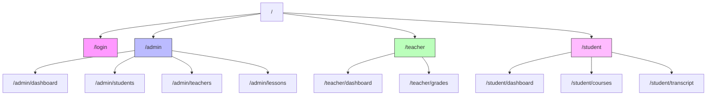

### Route Guard (middleware.ts)

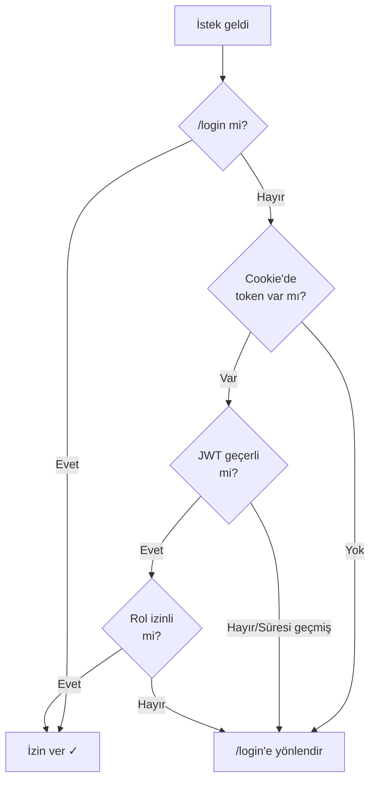

---

## 6. Kimlik Doğrulama Akışı

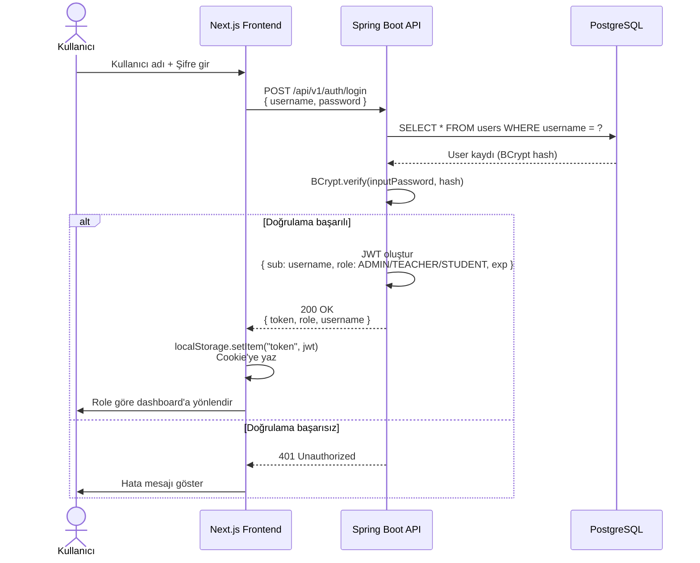

### JWT Token Yapısı

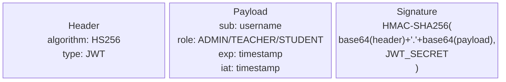

---

## 7. Önyüz ↔ Arkayüz İletişimi

### API İletişim Katmanı (lib/api.ts)

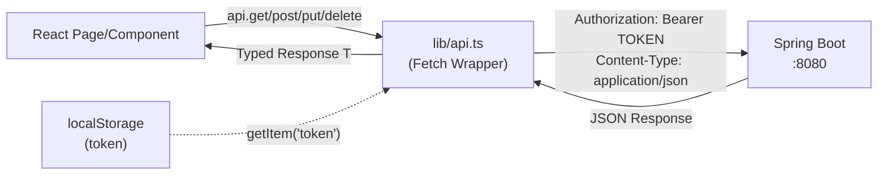

### Uçtan Uca İstek Akışı

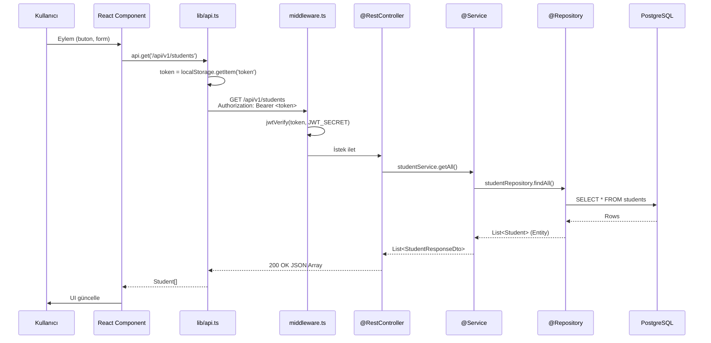

### Planlanan API Endpoint'leri

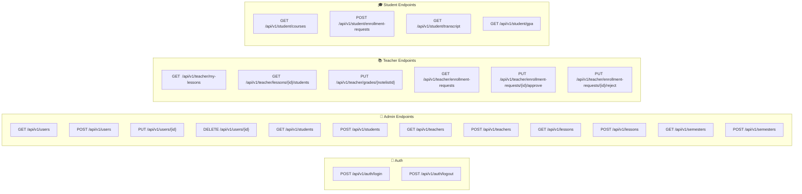

### HTTP Durum Kodları

| Kod | Anlam | Kullanım |
|---|---|---|
| `200 OK` | Başarılı | GET, PUT yanıtları |
| `201 Created` | Oluşturuldu | POST yanıtları |
| `204 No Content` | İçerik yok | DELETE yanıtları |
| `400 Bad Request` | Geçersiz istek | Validation hatası |
| `401 Unauthorized` | Kimlik doğrulanamadı | Geçersiz/eksik token |
| `403 Forbidden` | Yetkisiz | Role uyumsuz erişim |
| `404 Not Found` | Bulunamadı | Kayıt mevcut değil |
| `409 Conflict` | Çakışma | Duplicate kayıt |
| `500 Internal Server Error` | Sunucu hatası | Beklenmedik hata |

---

## 8. RBAC

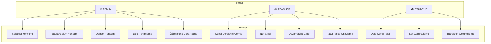

---

## 9. Not Hesaplama Mantığı

### Otomatik Hesaplama (Veritabanı Trigger)

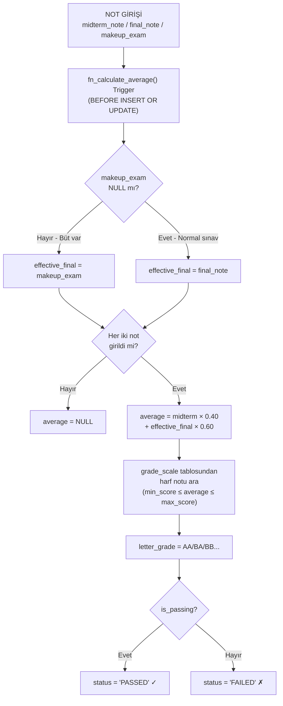

### Not Cetveli

| Harf | Aralık | GPA | Durum |
|---|---|---|---|
| AA | 90.00 – 100.00 | 4.00 | ✅ Geçti |
| BA | 85.00 – 89.99 | 3.50 | ✅ Geçti |
| BB | 80.00 – 84.99 | 3.00 | ✅ Geçti |
| CB | 75.00 – 79.99 | 2.50 | ✅ Geçti |
| CC | 70.00 – 74.99 | 2.00 | ✅ Geçti |
| DC | 65.00 – 69.99 | 1.50 | ✅ Geçti |
| DD | 60.00 – 64.99 | 1.00 | ✅ Geçti |
| FD | 50.00 – 59.99 | 0.50 | ❌ Kaldı |
| FF | 0.00 – 49.99 | 0.00 | ❌ Kaldı |

### GPA Hesaplama (vw_student_gpa view)

$$GPA = \frac{\sum(\text{kredi} \times \text{gpa\_point})}{\sum(\text{kredi})}$$

---

## 10. Docker Altyapısı

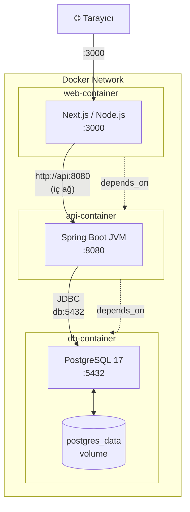

### Servis Konfigürasyonu

| Servis | Image | Port | Ortam Değişkenleri |
|---|---|---|---|
| `db` | `postgres` (official) | `5432:5432` | `POSTGRES_DB`, `POSTGRES_USER`, `POSTGRES_PASSWORD` |
| `api` | `./backend` (Dockerfile) | `8080:8080` | `DB_HOST=db`, `DB_PORT`, `DB_NAME`, `DB_USER`, `DB_PASS` |
| `web` | `./frontend` (Dockerfile) | `3000:3000` | `NEXT_PUBLIC_API_URL=http://api:8080` |

---

## 11. Proje Durumu

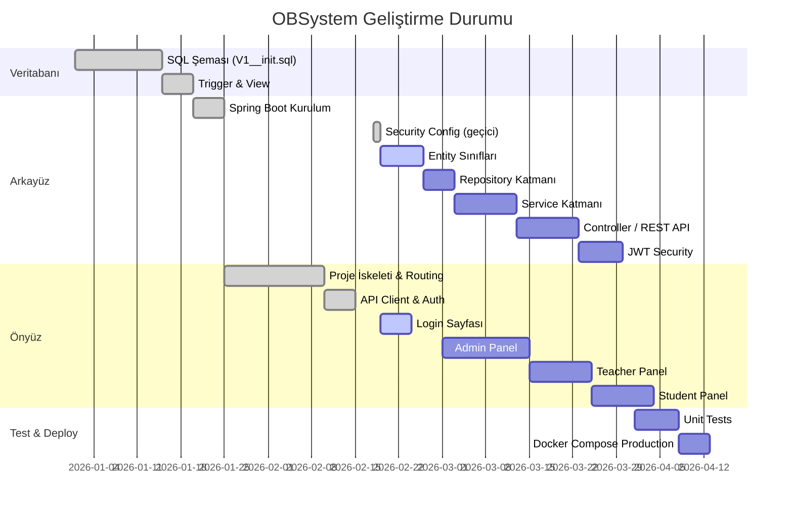

### Tamamlanan / Bekleyen Bileşenler

| Bileşen | Durum |
|---|---|
| ✅ Veritabanı şeması (SQL, trigger, view) | **Tamamlandı** |
| ✅ Docker Compose 3-konteyner kurulum | **Tamamlandı** |
| ✅ Frontend routing yapısı (Next.js App Router) | **Tamamlandı** |
| ✅ JWT middleware (route guard) | **Tamamlandı** |
| ✅ API istemci (`lib/api.ts`, `lib/auth.ts`) | **Tamamlandı** |
| ✅ TypeScript tip tanımları | **Tamamlandı** |
| ⚙️ Spring Boot güvenlik (geçici açık) | **Geçici** |
| ❌ JPA Entity sınıfları | **Bekliyor** |
| ❌ Repository katmanı | **Bekliyor** |
| ❌ Service katmanı | **Bekliyor** |
| ❌ REST Controller'lar | **Bekliyor** |
| ❌ JWT filtresi (Spring Security) | **Bekliyor** |
| ❌ Login sayfası (form + API entegrasyonu) | **Bekliyor** |
| ❌ Admin/Teacher/Student panel UI | **Bekliyor** |

dosya yapısı:
backend
src/main/java/com/obs/
├── config/              # Konfigürasyon sınıfları (Security, Swagger, ModelMapper)
├── controller/          # REST API Endpoints (Sadece istek karşılar)
├── service/             # İş mantığının kalbi (Interface + Impl)
│   ├── impl/            # Servis implementasyonları
│   └── rules/           # Özel iş kuralları (GradeCalculator, AttendanceChecker)
├── repository/          # Database erişimi (Spring Data JPA)
├── entity/              # Veritabanı modelleri (ER diyagramındaki tablolar)
├── dto/                 # Veri taşıma objeleri (Request/Response modelleri)
│   ├── request/         # Frontend'den gelen veriler
│   └── response/        # Frontend'e dönen veriler
├── mapper/              # Entity <-> DTO dönüşüm sınıfları (MapStruct)
├── exception/           # Custom exceptionlar ve GlobalExceptionHandler
├── security/            # JWT, UserDetails ve Auth filtreleri
└── util/                # Yardımcı sınıflar (Constants, DateUtils)


### Kendimden Notlar

# bu OBS sisteminde 3. haftam ve Token management alanında gelişmeler kaydediyorum

Şöyleki JWT token entegrasyonunu tamamladım sayılır, şuan token içine kullanıcı id'sini gömdüm
böylece id için ekstra upraş vermeden id bilgisine ulaşabileceğim.
Token'ı cookie içerisinde tutuyorum böylece XSS saldırılarına karşı önlem almış oluyorum, bu en
güvenli yöntem.
Ayrıca önyüz tarafında tokenları kullanmam gerektiği her seferde token ayıklamak ile uğraşmamak için
önyüzde bir hook oluşturdum ve singleton yapısını kullandım.